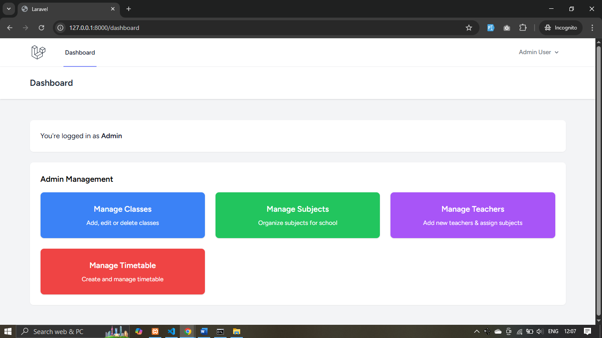

# 📚 School Timetable Management System

A Laravel-based web application to manage school classes, teachers, subjects, and timetables with conflict checks and role-based access control.

---

## 🚀 Features

- 🔐 **Authentication & Roles**
  - Admin can log in and manage everything
  - Teachers can log in and view their own timetable only

- 🏫 **Admin Panel**
  - Manage Classes (CRUD)
  - Manage Teachers (CRUD)
  - Manage Subjects (CRUD)
  - Assign teachers & subjects to classes per day and period
  - Conflict checks:
    - A teacher cannot be assigned to two classes in the same period
    - A class cannot have two subjects in the same period

- 📅 **Timetable Views**
  - View timetable by **Class** (grid view & list view)
  - View timetable by **Teacher**
  - Teacher dashboard shows only their timetable

- ⚡ **AJAX Integration**
  - Filtering timetable by class or teacher without full page reload

---

## 🛠️ Tech Stack

- **Backend:** Laravel 10, PHP 8.2
- **Frontend:** Blade, TailwindCSS, Alpine.js, jQuery (for AJAX)
- **Database:** MySQL
- **Authentication:** Laravel Breeze
- **Version Control:** Git & GitHub
- **Node.js** (for compiling assets using Vite)

---

## 📂 Database Schema (Overview)

- **Users Table**
  - `id`, `name`, `email`, `password`, `role` (`admin`, `teacher`)
- **Classes Table**
  - `id`, `name`
- **Subjects Table**
  - `id`, `name`
- **Teachers Table**
  - `id`, `user_id` (FK → users)
- **Timetables Table**
  - `id`, `day`, `period`, `class_id`, `subject_id`, `teacher_id`

**Default Database Name:** `school_timetable`  
**Database Dump:** `database/school_timetable.sql`

---

## 🔑 Default Credentials

- **Admin**
  - Email: `admin@school.com`
  - Password: `12345678`

- **Teacher**
  - Email: `teacher@school.com`
  - Password: `12345678`

---

## 🖼️ Screenshots

- **Login Page**  
  

- **Admin Dashboard**  
  

- **Teacher Timetable**  
  

---

## ⚙️ Installation & Setup

### 1. Clone the repository:

```bash
git clone https://github.com/Cp8233/school-timetable.git
cd school-timetable
